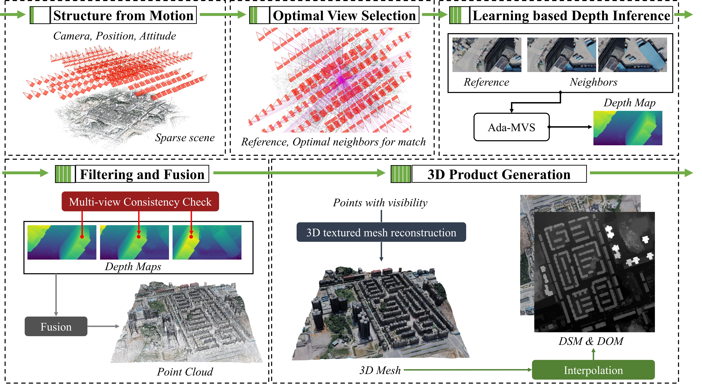

# Deep3D Framework

## Overview
This repository provides the official implementation of the paper *Deep learning based multi-view stereo matching and 3D scene reconstruction from oblique aerial images*.  
Deep3D is a general deep learning framework for performing three-dimensional (3D) reconstruction of the Earth’s surface from multi-view aerial images.   



**Authors:**  [Jin Liu](https://gpcv-liujin.github.io/), [Jian Gao](https://ygaojiany.github.io/), [Shunping Ji](http://gpcv.whu.edu.cn/), Chang Zeng, Shaoyi Zhang, JianYa Gong  
**Institution:** School of Remote Sensing and Information Engineering, Wuhan University.

## Environment
This project has been tested with the following environment:

| Key Package           | Version     |  
| --------------------- | ----------- |  
| python                | 3.6.12      |  
| pytorch               | 1.3.0       |  
| imageio               | 2.9.0       |  
| gdal                  | 3.0.2       |  
| numpy                 | 1.19.2      |  
| numpy-groupies        | 0.9.13      |  
| pillow                | 8.1.0       |  
| opencv-python         | 4.1.1.26    |  
| laspy                 | 1.5.1       |

Here is another verified environment:

| Key Package           | Version     |  
| --------------------- | ----------- |  
| python                | 3.8.19      |  
| pytorch               | 2.3.1       |  
| imageio               | 2.9.0       |  
| gdal                  | 3.6.1       |  
| numpy                 | 1.23.5      |  
| numpy-groupies        | 0.9.13      |  
| pillow                | 8.1.0       |  
| opencv-python         | 4.10.0.84   |  
| laspy                 | 1.5.1       |


## data preparation
Prepare a workspace within the ```example``` folder.
The preprocessed example data can be downloaded from the Link: https://pan.baidu.com/s/1rpBWkmRfZMG4IUh0RqU8JQ?pwd=kfa3 code: kfa3. 
The example data is sourced from the [WHU_OMVS predict set](http://gpcv.whu.edu.cn/data/WHU_OMVS_dataset/WHU_dataset.htm).  

#### 1. Image files
In the  ```images``` folder, images placed in one sub-folder should have the same intrinsic camera parameters.

#### 2. Info files
In the ```export``` folder, the info files should include:   

| File                           | Contents                               |  
| ---------------------          | -----------                            |  
| sparse_model                   | Sparse model output from COLMAP        |  
| image_path.txt                 | Storage path of each image             |  
| center_offset.txt (optional)   | Offset value of  the scene center      |  


**(1) image_path.txt**
```
total number of images
IMAGE_ID IMAGE_NAME ABSOLUTE_IMAGE_PATH
...
```

**(2) center_offset.txt(optional)**
```
# Center offset
X_OFFSET
Y_OFFSET
Z_OFFSET
```

#### 3. Modify the configuration file
The configuration options are stored in a *.yaml* file. Below is a sample configuration:
``` 
PREPROCESS:                                   # data preprocessing configuration
  fext: ".png"                                # image format extension
  cams_ori: "XrightYup"                       # camera orientation
  rotation_ori: "Rwc"                         # camara rotation type
  translation_ori: "twc"                      # camera translation type
  image_w: 3712                               # image width （should be divisible by 64）
  image_h: 5504                               # image height （should be divisible by 64）
  image_scale: 0.5                            # image scale 

VIEWSELECTION:                                # view selection configuration
  run_view_selection: true                    # run view selection or not
  view_selection_mode: "triangulated_points"  # mode of view selection
  scene_block_size: [300, 600, 600]           # size of each scene block [Xrange, Yrange, Zrange]
  block_overlap: 4                            # overlap of adjacent blocks
  bbx_border_scene: [-430.0, 150.0, -330.0, 250.0, 700.0, 900.0]  # bounding box of target scene [Xmin, Xmax, Ymin, Ymax, Zmin, Zmax]

DENSEMATCH:                                   # dense matching configuration
  run_mvs: true                               # run mvs inference or not
  view_num: 5                                 # number of matching views in mvs
  num_depth: 384                              # number of depth samples 
  min_interval: 0.1                           # depth sampling interval
  model_type: "adamvs"                        # pretrained model 
  pretrain_weight: null                       # path to pretrained weights
  display_depth: true                         # output visual depth map or not

FUSION:                                       # depth map fusion configuration
  run_depth_fusion: true                      # run depth fusion or not
  fusion_num: 10                              # number of neighboring views in consistency check
  geo_consist_num: 4                          # geometric consistency check threshold
  photomatric_threshold: 0.2                  # photomatric check threshold
  position_threshold: 1                       # reprojection error threshold
  depth_threshold: 0.01                       # relative depth error threshold
  normal_threshold: 90.0                      # normal angle error threshold
  pc_format: "ply"                            # dense point cloud format

CREATEMESH:                                   # mesh construction configuration
  run_create_mesh: true                       # create mesh or not
  recons_insert_distance: 1.5                 # insert distance in mesh construction (refer to OPENMVS)
  recons_decimate_ratio : 1                   # decimate ratio in mesh construction [0, 1] (refer to OPENMVS)
  refine_decimate_ratio : 1                   # decimate ratio in mesh refinement  [0, 1] (refer to OPENMVS)
  texture_decimate_ratio: 1                   # decimate ratio in mesh texture mapping  [0, 1] (refer to OPENMVS)
  refine_scale_times: 1                       # times of scaling in mesh refinement (refer to OPENMVS)

CREATEDSM:                                    # dsm creation configuration
  run_create_dsm: true                        # create dsm or not
  dsm_source: "mesh"                          # source data （options:[mesh, pc]）
  pc_select_method: "Robust_Max"              # samping method if source data is "pc" choose from [Max, Robust_Max]
  pc_interpolation_method: null               # interpolation method if source data is "pc", choose from [null, MovingAverage]
  dsm_uint: [0.2, 0.2]                        # cell size of dsm result [x, y]
  dsm_size: [2900, 2900]                      # number of grid cells [x, y]
  bbx_border_dsm: [-430.0, 150.0, -330.0, 250.0, 700.0, 900.0]  # range of dsm result [Xmin, Xmax, Ymin, Ymax, Zmin, Zmax]
```


## Usage
Once the configuration and info files are set up, run the pipeline using:
```
python run.py --workspace_folder example/workspace --data_folder example/workspace/export --config example/workspace/config.yaml
```

If you want to run the pipeline on your own data, please create new info files and adjust the configuration file for your own data.


## License
This project is licensed under the GNU GPL v3 License.


## Citation
If you find this code useful, please cite the following papers:
```
@article{liu_deep_2023,
	title = {Deep learning based multi-view stereo matching and {3D} scene reconstruction from oblique aerial images},
	journal = {ISPRS Journal of Photogrammetry and Remote Sensing},
	author = {Liu, Jin and Gao, Jian and Ji, Shunping and Zeng, Chang and Zhang, Shaoyi and Gong, JianYa},
	month = oct,
	year = {2023},
	pages = {42--60},
	volume = {204},
	issn = {09242716},
}
```
```
@article{yu_automatic_2021,
	title = {Automatic {3D} building reconstruction from multi-view aerial images with deep learning},
	journal = {ISPRS Journal of Photogrammetry and Remote Sensing},
	author = {Yu, Dawen and Ji, Shunping and Liu, Jin and Wei, Shiqing},
	month = jan,
	year = {2021},
	pages = {155--170},
	volume = {171},
	issn = {0924-2716},
}
```
```
@inproceedings{liu_novel_2020,
	title = {A {Novel} {Recurrent} {Encoder}-{Decoder} {Structure} for {Large}-{Scale} {Multi}-{View} {Stereo} {Reconstruction} {From} an {Open} {Aerial} {Dataset}},
	booktitle = {2020 {IEEE}/{CVF} {Conference} on {Computer} {Vision} and {Pattern} {Recognition} ({CVPR})},
	publisher = {IEEE},
	author = {Liu, Jin and Ji, Shunping},
	month = jun,
	year = {2020},
	pages = {6049--6058},
}
```

## Acknowledgement
We acknowledge the authors of the following works:
Cascade MVS-Net: https://github.com/alibaba/cascade-stereo
UCSNet: https://github.com/touristCheng/UCSNet  

This project also relies on the COLMAP and OPENMVS projects.